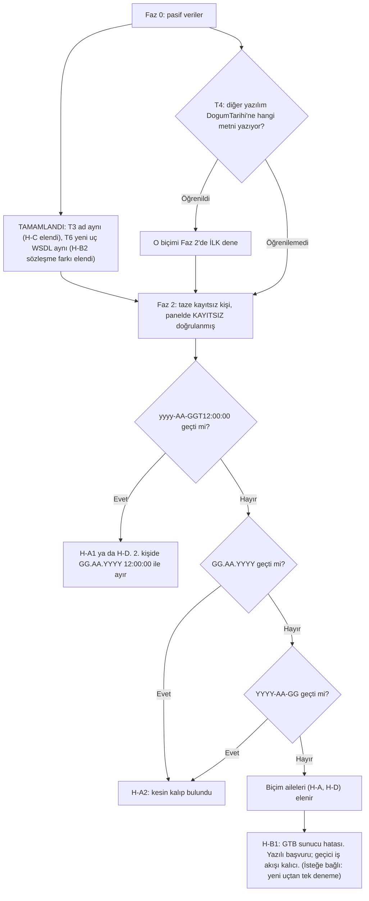

# HKS: Kayıtsız Müstahsilde İlk Bildirimde "Mernis'te Bulunamadı" Hatası

**Teşhis raporu ve çözüm planı**

| | |
|---|---|
| Tarih | 2026-10-01 (güncelleme: 2026-10-02, yeni uç WSDL'i + ad teyidi) |
| Kapsam | `halkayit/` (Hal Kayıt modülü), Satın Alım (referanssız) |
| Durum | Analiz. Üretim koduna dokunulmadı. |
| Gizlilik | Kişisel veri yok. TC'ler maskeli (`***5022`), kişiler "Kişi-N", tarih örnekleri kurgusal. |

**Kanıt düzeyleri**

| Düzey | Anlamı |
|---|---|
| **KESİN** | Doğrudan kanıt var: canlı WSDL, canlı istek/yanıt, kod satırı ya da git kaydı. |
| **GÜÇLÜ** | Birden çok bağımsız kanıt aynı yönü gösteriyor, ama doğrudan ölçülmedi. |
| **ORTA** | Akla yatkın ve gözlemlerle uyumlu. Bir rakip açıklama hâlâ ayakta. |
| **ZAYIF** | Tek bir dolaylı ipucu var ya da kanıt kirli. |

---

## 1. Yönetici özeti

- **Kesin olan (KESİN):** Eski uçta (`hks.hal.gov.tr/WebServices`) `DogumTarihi` alanı var. Tipi **metin** (`xs:string`), yeri alfabetik sıra (CepTel ile Eposta arası). Canlıda alan doğru yerde gidiyor ve sunucu tarafından okunuyor.
- Hata satır düzeyinde geliyor (`HataKodu=21`). **Künye oluşmadı, rüsum doğmadı.**
- **Değerler doğru (GÜÇLÜ):** HKS sitesi aynı TC ve doğum tarihiyle kişiyi Mernis'te buluyor. Sorun verimizde değil, sunucunun **tanımadığı kişi** için yaptığı KPS adımında.
- **"Site Sorgula sonrası geçiyor" mekanizması (GÜÇLÜ):** Sorgula, kişiyi HKS'e tanıtıyor. Tanınan kişide KPS adımı atlanıyor ya da önbellekten geçiyor. Aynı istek bu yüzden ikinci seferde başarılı oluyor.
- **En olası teknik kök neden (ORTA):** Sunucu metin olarak gelen tarihi **kendisi ayrıştırıyor** ve yanlış yorumluyor. İki olası biçim var:
  - Gün ile ay yer değiştiriyor (en-US/Invariant kültürü).
  - Sunucu bizimkinden farklı, kesin bir kalıp bekliyor.
- **Elenen açıklamalar (02.10 güncellemesi):**
  - **Yeni uç farklı sözleşme kullanıyor:** ELENDİ (KESİN). Yeni ucun (`ws.gtb.gov.tr:8443`) canlı WSDL'i eskisiyle birebir aynı; `DogumTarihi` orada da `xs:string` ve alfabetik. "Diğer sistemler yeni ucu kullandığı için çalışıyor" açıklaması sözleşme düzeyinde geçersiz.
  - **Ad-soyad tutmuyor:** Kişi-2'de ELENDİ. Gönderdiğimiz ad, sitede Sorgula'nın getirdiği adla harfi harfine aynı (kullanıcı teyidi). Ana sebep olarak ZAYIF.
- **Kalan rakip açıklama:** HKS'in web servis yolundaki KPS adımı bozuk (ORTA-DÜŞÜK). İki uç aynı sözleşmeyi taşıdığı için bu durumda büyük olasılıkla ikisinde de bozuktur.
- **Sonuç:** Fark isteğin **yapısında** değil, **doğum tarihi metninin değerinde/biçiminde**. Bizim XML'imiz iki ucun şemasına da tam uyuyor. Elde kalan en güçlü aday H-A (tarih biçimi).
- **Hemen yapılacak geçici çözüm (kod gerektirmez):** Yeni müstahsil için önce hks.hal.gov.tr'de TC ve doğum tarihiyle **Sorgula** yapın (bildirimi sitede tamamlamayın), sonra panelden gönderin.
- **Kalıcı çözüm yolu:**
  1. **Faz 1:** Teşhis ve kod temizliği. Konum "alfabetik" olarak sabitlenir, başarısız istekten öğrenme kaldırılır, her deneme maskeli olarak kayda alınır.
  2. **Faz 2 (asıl çözüm adımı):** Taze bir kişiyle 2–4 biçim denenir: `yyyy-AA-GGT12:00:00`, `GG.AA.YYYY`, `YYYY-AA-GG`. Mükerrer bildirim riski sıfırdır.
  3. **Faz 3:** GTB'den yazılı biçim teyidi. Yeni uca geçiş artık **kök çözüm değil**; eski uç kapatılabileceği için uzun vadeli bir uyum adımı.
- **Önceki kayıtlar yanıltıcı:** README, `config.php`, `hks_soap.php` ve CLAUDE.md'deki "son+gtb kanıtlandı" ve "Mernis = değer yanlış" ifadeleri **yanlış ya da eksik**. Kayıtsız kişi için web servisten **temiz bir başarı hiç alınmadı**.

---

## 2. Belirti ve tekrar üretme

**Senaryo:**

1. Satın Alım (BildirimTuru 195) bildirimi yapılıyor: referanssız, kayıtsız müstahsil, ilk kez.
2. Formda TC, ad-soyad, cep ve doğum tarihi doldurulup gönderiliyor.
3. HKS reddediyor.
4. Kullanıcı aynı kişiyi hks.hal.gov.tr'de TC ve doğum tarihiyle "Sorgula"yınca ad Mernis'ten geliyor.
5. Panelden aynı taslak tekrar gönderiliyor ve bu kez **hatasız** geçiyor.

**Hata kodları (canlı yanıt, 01.10):**

| Düzey | Alan | Değer | Anlamı |
|---|---|---|---|
| Zarf | `IslemKodu` / `ErrorModel` | `GTBWSRV0000002` | İşlem başarısız (genel) |
| Satır | `BildirimKayitCevap.HataKodu` | `21` | Satır reddedildi |
| Satır | `Mesaj` | "Tc kimlik numarası Mernis sisteminde bulunamadı. Tc Kimlik No: (IkinciKisiBilgileri.TcKimlikVergiNo) ***5022" | KPS adımı kişiyi bulamadı |
| Satır | `YeniKunyeNo` / `RusumMiktari` | `0` / `0` | **Künye yok, rüsum yok** |

**"Yalnız ilk kayıtta" davranışı:**

- Hata yalnız HKS'in henüz **tanımadığı** kişide çıkıyor. Kişi bir kez sitede sorgulandıktan ya da bildirildikten sonra aynı istek geçiyor.
- Bu yüzden istek içeriği (sıfat, işyeri, mal bilgisi, TC biçimi) şüpheli listesinden çıkar (KESİN, mantık). Değişen tek şey sunucunun o kişiyle ilgili durumu.

**Görülen vakalar (maskeli):**

| Vaka | Tarih | Doğum tarihi sınıfı | Konum + biçim | Sonuç |
|---|---|---|---|---|
| Kişi-1 | 01.10 (önceki ekran) | gün > 12 | alfabetik + gtb | Mernis |
| Kişi-2 (`***5022`) | 01.10 (Teknik Detay) | gün ≤ 12, gün ≠ ay | alfabetik + gtb | Mernis |
| Kişi-3 | 05.09 10:45 | gün > 12 | alfabetik + gtb | Mernis |
| Kişi-4 (`***4512`) | 07.09 | gün > 12 | **son** + gtb | "doğum tarihi girilmelidir" (zarf düzeyi) |

---

## 3. Kesinleşen gerçekler

| # | Gerçek | Kanıt | Düzey |
|---|---|---|---|
| G1 | Eski uç sözleşmesi, 2016 sözleşmesiyle aynı 10 işlemi taşıyor. Tek fark: `IkinciKisiBilgileriDTO` içine **alfabetik konumda** `DogumTarihi (xs:string, nillable, minOccurs=0)` eklenmiş. Sıra: AdSoyad, CepTel, **DogumTarihi**, Eposta, KisiSifat, TcKimlikVergiNo, YurtDisiMi. | Canlı `?singleWsdl` (kullanıcı çekti, 3. ve 4. yapıştırma). OfisHal 2016 WSDL kopyasıyla karşılaştırıldı. | KESİN |
| G2 | Alan tipi **metin**. WCF tarihi hiç dönüştürmüyor, ham metni olduğu gibi GTB koduna bırakıyor. Dönüşümü sunucu kodu yapıyor ve beklediği biçim şemada yazmıyor. | Canlı WSDL. Haziran 2026'daki eski `hks/` modülü de alanı `string` olarak okumuştu (git `60a8036`). | KESİN |
| G3 | Canlıda **alfabetik + gtb** gidiyor: `<b:DogumTarihi>GG.AA.YYYY 00:00:00</b:DogumTarihi>`, CepTel ile KisiSifat arasında. | Canlı istek (01.10) | KESİN |
| G4 | **"son" konumu sunucuda atlanır.** DataContractSerializer elemanları yalnız ileriye doğru arar; YurtDisiMi'den sonra gelen DogumTarihi sessizce yok sayılır. 07.09'daki "girilmelidir" hatası bunun sonucu. | WSDL sırası + DCS kaynak kodu (`XmlObjectSerializerReadContext`) + 07.09 yanıtı | KESİN |
| G5 | Sunucu TC'yi okudu (mesajda yankılanıyor) ve SOAP fault yok. Yani DogumTarihi'nden sonra gelen alanlar da okunuyor; DCS tarafında sorun yok. | Canlı yanıt | KESİN |
| G6 | Ret satır düzeyinde: `HataKodu=21`, `YeniKunyeNo=0`, `RusumMiktari=0`. Panel bunu "hiç künye yok" sayıyor ve taslağı koruyor. | Canlı yanıt; `api.php:606-616` | KESİN |
| G7 | TC ve doğum tarihi değerleri doğru: site aynı değerlerle Mernis'ten adı çekiyor. | Kullanıcı gözlemi (sitede aynı değerlerin girildiği varsayımıyla) | GÜÇLÜ |
| G8 | Sistemdeki öğrenilmiş varyant alfabetik+gtb. Kod yalnız merdiven en az 2 adım attığında ve son adım "girilmelidir" olmadığında öğreniyor. Satır düzeyinde Mernis de bu koşulu sağlıyor. Yani varyant **başarısız bir istekten** öğrenilmiş olabilir (`kanit` alanında "GTBWSRV0000002…" yazar). | `hks_soap.php:666-686` | KESİN (mekanizma), GÜÇLÜ (fiilen böyle olduğu; Faz 0 T1 doğrular) |
| G9 | Kayıtsız kişi için web servisten **temiz bir başarı kaydı yok.** 05.09 10:51'deki künye "son" konumla geldi; bu konumda doğum tarihi atlanır (G4). Demek ki kişi büyük olasılıkla zaten tanınıyordu. Başarılı istekte `hamIstek` saklanmadığı için tele ne çıktığı da görülmedi. | Git `e251281`, `e258914`; `hks_soap.php:642` | GÜÇLÜ |
| G10 | "ISO biçimi de başarısız oldu" iddiası kanıtsız. ISO denemelerinin tele çıkan hâli kaydedilmemiş. Dönem (17.08–05.09) bayat doğum tarihi, kirli TC ve boş doğum tarihi hatalarıyla çakışıyor (22–28.08 arası düzeltildi). | Git `8a8d565`…`6b763e3`, `fdb26ef` | KESİN (kayıt yok), iddianın kendisi ZAYIF |
| G11 | Referanssız Satın Alım gönderiminde kişinin kayıt durumu **gönderim anında sorulmuyor** (`kayitZorunlu:false`). Hiçbir denemede "kişi o an tanınıyor muydu" bilgisi yok. | `app.html:3493`, `api.php:551` | KESİN |
| G12 | Yeni uç (8443) kullanıcının mobil internetinden erişilebiliyor. `?singleWsdl` gateway'de "Servis Bulunamadi" fault'u dönüyor, `?wsdl` çalışıyor. Hostingden ise TCP bağlantısı kurulamıyor. | Kullanıcı testi; README:349-351 | KESİN (gözlem). Sebep (hosting çıkış güvenlik duvarı ya da IP beyaz listesi): ORTA |
| G13 | **Yeni ucun sözleşmesi eskisiyle aynı.** `https://ws.gtb.gov.tr:8443/HKSBildirimService?wsdl` → `soap:address` `https://ws.gtb.gov.tr:8443/HKSBildirimService`; aynı 10 işlem, aynı SOAPAction'lar. `IkinciKisiBilgileriDTO` birebir aynı: AdSoyad, CepTel, **DogumTarihi (`xsd:string`)**, Eposta, KisiSifat, TcKimlikVergiNo, YurtDisiMi. Öteki DTO'lar da aynı. Biçim (`xsd:` öneki, `tempuri.org`, alfabetik sıralı mesajlar) bir ağ geçidinin arkadaki WCF servisinin WSDL'ini yeniden yayımladığını gösteriyor. | Kullanıcının tarayıcıdan çektiği canlı WSDL (02.10, kaynak teyitli) | KESİN (sözleşme). Aynı arka uca gittiği: GÜÇLÜ |
| G14 | **Kişi-2'de ad-soyad birebir tutuyor.** Gönderdiğimiz `AdSoyad`, sitedeki Sorgula'nın Mernis'ten getirdiği adla harfi harfine aynı. | Kullanıcı teyidi (02.10) | KESİN (bu vaka için) |

> **Not, WSDL yapıştırmaları:** "BildirimSorgu" adı yeni bir işlem değil; iki uçta da iki liste işleminin mesaj adı. 3. ve 4. yapıştırma eski uçtan (`?singleWsdl`), 2. yapıştırmanın tamamı yeni uçtan (`?wsdl`) geldi. İkisi karşılaştırıldı: sözleşme farkı yok (G13).

---

## 4. Kök neden hipotezleri

### 4.1 Ortak mekanizma: "Site Sorgula sonrası neden geçiyor?"

- **Sitedeki Sorgula:** Doğum tarihini gün/ay/yıl seçicisinden **yapılandırılmış** olarak alır ve KPS'e gönderir. Tarih metni ayrıştırılmaz. Mernis kişiyi bulur, ad forma dolar.
- **Sorgula'nın etkisi:** Kişi HKS'e "tanınan kişi" olarak kaydoluyor ya da önbelleğe giriyor. Kullanıcı gözlemi ve `e258914` notu bu yönde (GÜÇLÜ).
- **Sonraki web servis bildirimi:** Kişi tanındığı için KPS adımı **çalışmıyor** ya da önbellekten geçiyor. Bu yüzden doğum tarihimizin nasıl yorumlandığı artık önemsiz.

Bu mekanizma aşağıdaki **bütün** hipotezlerle uyumlu. Tek başına hiçbirini elemez. Asıl soru şu: web servis yolunda, tanınmayan kişi için yapılan KPS adımında **ne bozuluyor?**

> **Açık nokta:** `e258914` "siteden **bildirilip** kaydolduktan sonra" diyor, kullanıcı bugün "yalnız **Sorgula** yeterli" diyor. Bu fark Faz 0'da netleştirilecek (T2, T10).

### 4.2 Özet tablo

| Hipotez | Olasılık | Belirleyici test |
|---|---|---|
| **H-A** Sunucu tarih metnini yanlış ayrıştırıyor (kültür ya da kalıp) | **ORTA-GÜÇLÜ** (en güçlü aday; G13 ve G14'ten sonra) | Faz 2: ISO+öğlen ve yalnız-tarih biçimleri |
| **H-B1** Web servis yolunun KPS adımı doğum tarihini iletmiyor ya da eski bir KPS işlemini kullanıyor (iki uçta da aynı) | ORTA-DÜŞÜK | Faz 2'de bütün biçimler başarısız → GTB |
| **H-B2** Yeni uç (8443) farklı ve düzgün bir arka uca gidiyor | **Sözleşme farkı ELENDİ** (G13). Aynı sözleşmeyle farklı arka uç: ZAYIF | Gerekirse Faz 3 (yeni uçla gönderim) |
| **H-C** Yazdığımız ad-soyad Mernis kaydıyla birebir tutmuyor | **ZAYIF** (Kişi-2'de elendi, G14) | Faz 2 kayıtlarında ad karşılaştırması sürer |
| **H-D** Saat dilimi dönüşümü günü bir gün geri kaydırıyor | DÜŞÜK-ORTA | Faz 2: öğlen (12:00) saati |
| **H-E** Sunucu filosunda sürüm tutarsızlığı | DÜŞÜK | Aynı isteğin geçmiş tekrarları; Faz 2 kayıtları |

### 4.3 Hipotezlerin ayrıntısı

**H-A: Sunucu metni yanlış ayrıştırıyor (ORTA)**

İki alt biçimi var:

- **A1, kültür:** Sunucu `DateTime.Parse/TryParse` ya da `Convert.ToDateTime` gibi kültüre bağlı bir çağrıyı en-US/Invariant kültürde (AA/GG sırası) çalıştırıyor:
  - `28.09.1985 …` (gün > 12) ayrıştırılamaz. `TryParse` false döner, tarih boş ya da `MinValue` kalır, KPS kişiyi bulamaz.
  - `11.02.1960 …` (gün ≤ 12) **sessizce 2 Kasım 1960** olur. Yine bulunamaz.
- **A2, kalıp:** Sunucu `ParseExact` ile bizimkinden farklı bir kalıp bekliyor (ör. yalnız `GG.AA.YYYY` ya da `YYYY-AA-GG`).

| | |
|---|---|
| **Açıkladığı** | Bütün vakalar (gün > 12 ve gün ≤ 12). %100 başarısızlık. Site yolunun geçmesi (site metin ayrıştırmaz). "Diğer sistemler" farklı bir biçim gönderiyorsa onların çalışması. GTB örneğindeki `01.01.1980` gün = ay olduğu için A1 hatasını hiç göstermez. |
| **Açıklamadığı** | (1) ISO denemeleri temizse A1 elenir; ama bu kanıt ZAYIF (G10). (2) Gün > 12'de `FormatException` beklenirdi; Mernis gelmesi `TryParse` ya da yutulan bir istisna gerektirir. Bu, yaygın bir kodlama deseni. (3) A2 doğruysa GTB'nin kendi örneği yanlış demektir. |
| **Kesinleştirir / eler** | Faz 2. Ayrıca fırsat çıkarsa: gün = ay olan (ör. 05.05.19xx) yeni bir kişi **bugünkü biçimle** siteye uğramadan geçerse A1 güçlü biçimde doğrulanır. |

**H-B1: Web servis yolunun KPS entegrasyonu bozuk ya da eski (ORTA-DÜŞÜK)**

| | |
|---|---|
| **Açıkladığı** | Biçimden bağımsız %100 başarısızlık. Site yolunun geçmesi (site farklı bir kod yolu). |
| **Açıklamadığı** | "Diğer sistemler çalışıyor" bilgisi. Bu bilgi doğruysa ve onlar da aynı senaryoyu (kayıtsız + ilk kez + sitede sorgulanmamış) yaşıyorsa H-B1 zayıflar. GTB alanı eski sözleşmeye ekleyip boşluk denetimini de koymuş ("girilmelidir"); iletimi unutmuş olması düşük olasılık. |
| **Kesinleştirir / eler** | Faz 2'de bütün biçimler başarısız olur ve H-C elenmişse H-B1 kalır. Sonraki adım GTB'ye yazılı başvuru. |

**H-B2: Yeni uç farklı (düzgün) bir arka uç (sözleşme farkı ELENDİ; arka uç farkı ZAYIF)**

| | |
|---|---|
| **Açıkladığı** | "Diğer sistemler" yeni ucu kullanıyorsa onların çalışması. GTB'nin "birlikte kullanım 27.03.2025'e kadar" demesi. |
| **Açıklamadığı** | **G13:** yeni ucun WSDL'i eskisiyle birebir aynı. Yayımlanma biçimi, arkadaki aynı WCF servisini sunan bir ağ geçidine işaret ediyor. Aynı sözleşmeyle farklı davranan bir arka uç ancak GTB'nin iki ayrı sürümü paralel işletmesiyle mümkün; bunun kanıtı yok. |
| **Kesinleştirir / eler** | T6 **tamamlandı** (G13). Kalan şüphe yalnız canlı bir yeni uç gönderimiyle elenir (Faz 3), ama bu artık öncelik değil. |

**H-C: Ad-soyad eşleşmiyor (ZAYIF; Kişi-2'de elendi)**

> **02.10 güncellemesi (G14):** Kişi-2 için gönderdiğimiz ad, sitedeki Sorgula'nın getirdiği adla harfi harfine aynı çıktı. Bu vakada H-C **elendi**. Hipotezin %100 başarısızlığı açıklaması için her kişide bir fark gerekirdi; tek bir temiz vaka bile onu ana sebep olmaktan çıkarır. Aşağıdaki değerlendirme kayıt için duruyor.

Bu hipotezi destekleyen iki gözlem var:

- Sitede ad Mernis'ten **gelir**. Bizde ise kullanıcı **elle yazar** (ya da kişi havuzundan gelir; o kayıt da elle yazılmıştır).
- KPS doğrulama servisleri ad, soyad, kimlik no ve doğum tarihini **birlikte** karşılaştırabilir ve hangi alanın tutmadığını söylemez.

Özellikle iki adlı (Mernis'te iki ad, günlük hayatta tek ad) yaşlı kişilerde bu gerçek bir risk.

| | |
|---|---|
| **Açıkladığı** | Tek tek vakalar. Site sonrası geçiş (tanınan kişide ad karşılaştırması yapılmıyor ya da HKS Mernis'teki adı kullanıyor). |
| **Açıklamadığı** | **%100 başarısızlık.** Her kişide bir yazım farkı olması gerekir; bu ancak sunucuda sistematik bir karşılaştırma hatasıyla (ör. Türkçe İ/I) mümkün. Mesaj da "ad uyuşmuyor" değil, "TC **bulunamadı**" diyor; bu, ad karşılaştırmasından çok TC + doğum tarihiyle yapılan bir **arama**ya uyuyor. Sitedeki Sorgula da arama gibi çalışıyor (TC + doğum tarihi verilir, ad döner). |
| **Kesinleştirir / eler** | Faz 0 T3 (pasif): siteden düzeltilen eski vakalarda gönderdiğimiz ad ile sitede çıkan ad **harfi harfine** aynıysa H-C o vaka için elenir. Farklıysa Faz 2'de kimlik kartındaki tam yazımla denenir. |

**H-D: Saat dilimi kayması (DÜŞÜK-ORTA)**

Sunucu metni ayrıştırıp `ToUniversalTime()` uygularsa gece yarısı (00:00) bir önceki güne düşer. Bu, her biçimi bozar, ISO dahil. Öğlen saati (12:00) ±3 saatlik dönüşümde günü değiştirmez. Belgelenmiş bir HKS/KPS hatası bulunamadı. **Faz 2'nin ilk adımı bunu zaten test eder.**

**H-E: Sunucu filosu tutarsızlığı (DÜŞÜK)**

Rastgele bir hata %100 sistematik başarısızlığı açıklamaz. Faz 2 kayıtlarında aynı biçim farklı sonuç verirse yeniden ele alınır.

### 4.4 Ajanlar arası çelişkilerin çözümü

**1. Kültür hipotezi ile "ISO da başarısız" çelişkisi**

- **Ajan 1:** Kültür hipotezini (A1) en güçlü aday sayıyor.
- **Ajan 3:** "Hem GG.AA.YYYY hem ISO başarısızsa A1 tek başına açıklayamaz" diyor. Bu mantık **doğru, ama dayandığı veri zayıf.** ISO denemelerinin tele çıkan hâli yok ve dönem kirli veriyle çakışıyor (G10).
- **Karar:** A1'i ne kesin ne elenmiş sayıyoruz. ISO doğru bir şekilde başarısız olsa bile geriye A2 (başka kalıp) ve H-D (kayma) kalır. Faz 2'nin üç biçimi bu üçünü birlikte ayırır.
- Ajan 3'ün "gün > 12'de FormatException beklenirdi" itirazı, sunucu `TryParse` kullanıyor ya da hatayı yutuyorsa geçersiz. Bu yaygın bir desen.

**2. 05.09'daki "son+gtb künye üretti" kanıtı**

- WSDL'e göre "son" konumunda doğum tarihi atlanır. O künye doğum tarihi **olmadan** üretildi.
- **Birinci okuma (GÜÇLÜ):** Kişi o sırada zaten tanınıyordu. Aynı sabah site yolu kullanılıyordu (`e258914`).
- **İkinci okuma (ZAYIF):** O gün sunucu doğum tarihinin varlığını henüz zorunlu tutmuyor ve yalnız TC ile sorguluyordu, 07.09'da zorunluluk eklendi. Bu, iki günde sunucu tarafında bir değişiklik gerektirir. KPSv2 TC sorgusunda doğum tarihini zaten zorunlu tutuyor, bu yüzden düşük olasılık.
- **Sonuç:** README, `config.php` ve `hks_soap.php`'deki "son konumu kanıtlandı" ve "aynı kişi, aynı kod, iki gün arayla farklı sonuç" ifadeleri **kayıtlarla desteklenmiyor.** 05.09 (gün > 12, 1960'lar) ile 07.09 (`***4512`) farklı kişiler.

**3. Ad-soyad hipotezi**

- Ajanlar bu hipotezi zayıf saydı. Bu rapor onu önce ciddi ama ikincil bir aday olarak ele aldı, çünkü sitede ad otomatik geliyor, bizde elle yazılıyor.
- **Karar (02.10):** Pasif ad karşılaştırması (T3) Kişi-2'de yapıldı: adlar aynı (G14). H-C ana sebep olarak **elendi**.

**4. Uç farkı**

- **Karar (02.10):** Yeni ucun WSDL'i alındı ve eskisiyle birebir aynı çıktı (G13). "Diğer sistemler yeni uçta, o yüzden çalışıyor" açıklaması sözleşme düzeyinde **geçersiz**.
- Yeni uca geçiş bu yüzden Mernis sorununun çözümü olarak beklenmemeli. Eski uç kapatılabileceği için yine de uzun vadede gerekli (Faz 3).

---

## 5. "Diğer sistemler neden çalışıyor?"

"Web servis kullanan diğer sistemlerde sorun yok" bilgisi bu vakadaki en değerli ama en az doğrulanmış veri.

> **Kısa cevap (02.10):** İki uç da aynı sözleşmeyi taşıyor (G13) ve bizim XML'imiz bu sözleşmeye tam uyuyor. Ad da tutuyor (G14). Geriye kalan fark **`DogumTarihi` alanına yazılan metin**. Alan `xs:string` olduğu için her yazılım bu metni kendi biçimiyle gönderiyor. Biz GTB'nin örneğindeki `GG.AA.YYYY 00:00:00` biçimini kullanıyoruz; diğer sistemler büyük olasılıkla sunucunun doğru ayrıştırdığı başka bir biçim gönderiyor. Bunu kesinleştirmenin en hızlı yolu, o yazılımın gönderdiği tek bir örnek istek ya da Faz 2 deneyi.

Olası farklar:

| Olası fark | İlgili hipotez | Not |
|---|---|---|
| Doğum tarihini **farklı bir biçimle** gönderiyorlar (ISO, yalnız tarih, öğlen saati) | H-A, H-D | **En olası açıklama.** Bir örnek istek bunu hemen çözer. |
| **Yeni ucu** (8443) kullanıyorlar | H-B2 | Sözleşme aynı (G13); fark yaratması beklenmez. |
| Adı siteden ya da KPS'ten alıyorlar, ya da kullanıcıları önce sitede sorguluyor | H-C ve ortak mekanizma | Ad farkı Kişi-2'de yok (G14). Ama kullanıcılarının önce sitede sorgulaması "çalışıyor" gözlemini kirletebilir. |
| WSDL'den üretilmiş istemci kullanıyorlar | (konum) | Konum sorunu bizde de artık yok (G3). Fark yaratmaz; tarih metni yine geliştiricinin elinde. |
| Aynı senaryoyu hiç yaşamıyorlar (kayıtlı kişiyle çalışıyorlar ya da başka bir bildirim türü kullanıyorlar) | — | Senaryonun birebir aynı olduğu teyit edilmeli. |

**Diğer yazılım sağlayıcısına sorulacak sorular:**

1. Hangi uç adresini kullanıyorsunuz: `hks.hal.gov.tr/WebServices/BildirimService.svc` mi, `ws.gtb.gov.tr:8443/HKSBildirimService` mi?
2. `IkinciKisiBilgileri.DogumTarihi` alanına **tam olarak hangi metni** yazıyorsunuz? Kişisel verisi maskelenmiş bir örnek istek paylaşabilir misiniz?
3. `AdSoyad` değerini nereden alıyorsunuz: kullanıcı mı yazıyor, bir sorgudan mı geliyor? `Eposta` gönderiyor musunuz?
4. Bildirimden önce kişi için başka bir servis çağrısı (sorgulama) yapıyor musunuz?
5. Şu senaryoyu kendi sisteminizde doğruladınız mı: HKS'te kayıtsız, sitede **hiç sorgulanmamış** bir müstahsilden **ilk** Satın Alım. Hem gün > 12 hem gün ≤ 12 doğum tarihleriyle mi?
6. İstemcinizi hangi WSDL'den ürettiniz? `DogumTarihi` sizde de `xs:string` mi?
7. Yeni uç için GTB'ye IP tanımı ya da beyaz liste başvurusu yaptınız mı?

---

## 6. Kodumuzda tespit edilen hatalar ve riskler

Her madde kodda doğrulandı.

| # | Sorun | Yer | Etkisi | Düzey |
|---|---|---|---|---|
| K1 | Varsayılan konum `'son'`. Eski uçta bu konum kesin yanlış (G4). Temiz kurulumda ilk istek her zaman "girilmelidir" alır. | `config.php:71` | Boşa giden istek; yanıltıcı başlangıç | KESİN |
| K2 | Merdiven yalnız **konumu** keşfedebiliyor. Biçim yalnız "girilmelidir" dalında değişiyor. Mernis gelince merdiven duruyor, bu yüzden biçim sorunu yapısal olarak keşfedilemiyor. | `hks_soap.php:130-138, 666-679` | Asıl şüpheli (biçim) hiç test edilmiyor | KESİN |
| K3 | **Başarısız istekten öğrenme.** Merdiven en az 2 adım atmışsa, son adımdaki **her** "girilmelidir dışı" sonuç öğreniliyor: Mernis ya da başka bir zarf hatası (ör. `GTBGLB00000001`) da olsa. Değer bütün firmalar için ortak ve süresiz. Arayüzde görünmüyor, sıfırlanamıyor. | `hks_soap.php:684-686`, `121-123` | Yanlış bir "doğru varyant" kalıcılaşabilir | KESİN |
| K4 | Başarılı istekte `hamIstek` saklanmıyor ya da dönmüyor. Kanıt yalnız başarısızlıklardan toplanıyor. 05.09'daki yanılgı buradan çıktı. | `hks_soap.php:630-642` | Başarının nedeni hiç görülemiyor | KESİN |
| K5 | Teşhis kutusundaki "HKS'e gönderilen doğum tarihi" aslında **formdaki ham değer** (`YYYY-AA-GG`). Teldeki biçim ve konum gösterilmiyor. | `api.php:590`, `app.html:4000-4001` | Operatör yanlış şeyi karşılaştırıyor | KESİN |
| K6 | Mernis'te ekran kullanıcıyı yalnız "kimlik kartıyla karşılaştırın / TC'yi elle yazın" diye yönlendiriyor. Değerin doğru olup sunucunun yanlış yorumlaması seçeneği hiç anılmıyor. | `app.html:4004-4005, 4044-4055` | Kullanıcı doğru veriyi boşuna kontrol ediyor | KESİN |
| K7 | Yeşil "✅ teslim edildi… öğrenildi" kutusu, merdiven 2+ adım attıysa **son adım Mernis olsa bile** çıkıyor. | `app.html:4029-4033` | Başarısızlık başarı gibi görünüyor | KESİN |
| K8 | "Dördü de reddedildi → alan yeni uçta" metni, alanın eski uçta olduğu kesinleştiği için yanlış. | `app.html:4024-4028` | Yanlış yönlendirme | KESİN |
| K9 | `j.genelHata`, `s.mesaj` ve `s.yeniKunyeNo` kaçışsız olarak `innerHTML`'e yazılıyor. HKS metni XML'de varlık-kaçışlı geldiği için pratik risk düşük, ama hijyen hatası. | `app.html:3990, 4041, 4043` | Düşük (XSS hijyeni) | KESİN |
| K10 | Gönderim anında kayıt durumu sorulmuyor (G11). Hiçbir denemede "o an tanınıyor muydu" yok. | `app.html:3493`, `api.php:551` | Deneyler yorumlanamıyor | KESİN |
| K11 | Yanlış yerleşik bilgi yayan belgeler: "son+gtb kanıtlandı / aynı kişi aynı kod", "Mernis = değer yanlış", "alan büyük olasılıkla yalnız yeni uçta", "Satın Alım'da künye üretildiği doğrulandı". | `config.php:33-34, 58-61, 80-83` · `hks_soap.php:51-57, 80-88, 140-146, 533-539, 550` · `api.php:542-545` · `README.md:215-267, 341-347` · `CLAUDE.md:1263-1264` | Sonraki geliştirici aynı yanlış yola girer | KESİN |

---

## 7. Çözüm planı

### 7.0 Karar ağacı



**Metin özeti:**

1. Ad karşılaştırması ve yeni uç sözleşmesi **tamamlandı**: ikisi de sorunu açıklamıyor.
2. Diğer yazılımın `DogumTarihi` metni öğrenilebilirse Faz 2'de ilk o denenir.
3. Taze bir kişiyle biçim deneyi yapılır.
   - Bir biçim geçerse sorun bulunmuştur. Biçim sabitlenir.
   - Hiçbiri geçmezse sorun GTB'nin web servis yolundadır (H-B1). Yazılı başvuru yapılır ve geçici iş akışı kalıcı hâle gelir.

### Faz 0: Bugün, kod yok

**0.1 Geçici iş akışı (operatör talimatı)**

| | |
|---|---|
| **Amaç** | Bildirimi bugün aksatmadan yapmak. |
| **Adımlar** | Panelde **Doğrula** kişiyi KAYITSIZ gösterirse: (1) hks.hal.gov.tr'de bildirim ekranında TC ve doğum tarihi girilip **Sorgula** yapılır. (2) Gelen ad **harfi harfine** panele yazılır. (3) Panelden gönderilir. |
| **Risk** | Yok. Resmi siteyle yapılan bir sorgu. |
| **Mükerrer / rüsum** | Sitede bildirim **tamamlanmamalı**. Yalnız Sorgula yapılır. Yoksa aynı mal iki kez bildirilir. |
| **Başarı ölçütü** | Mernis hatası sıfır. |
| **Efor** | Kişi başına 1–2 dakika. |

**0.2 Toplanacak teşhis verileri (hepsi pasif, HKS'e bildirim gitmez)**

| # | Veri | Nasıl | Neyi ayırır |
|---|---|---|---|
| T1 | `hks_kv.dogum_varyant` değeri (`konum`, `bicim`, `zaman`, `kanit`) | phpMyAdmin: `SELECT deger FROM hks_kv WHERE anahtar='dogum_varyant';` | K3: `kanit` "GTBWSRV…" ise varyant başarısız istekten öğrenilmiş |
| T2 | Site Sorgula'dan sonra panelde **Doğrula**: KAYITLI mı, KAYITSIZ mı? | Panel | Mekanizma: HKS kişi kaydı mı (KAYITLI), yalnız KPS önbelleği mi (KAYITSIZ kalır)? |
| T3 | ✅ **Tamamlandı (Kişi-2):** gönderdiğimiz ad sitede çıkan adla aynı (G14). Yeni vakalarda da kaydetmeye devam edin (adı yazmadan yalnız "aynı / fark türü"). | Teknik Detay + site ekranı | **H-C** → elendi |
| T4 | Diğer yazılımın ucu, `DogumTarihi` metni ve örnek isteği | Bölüm 5'teki sorular | H-A, H-B2 |
| T5 | GTB 12.03.2025 duyurusu ekindeki `Ornek_Request.txt` tam metni | GTB duyurusu | Resmi biçim ve eleman sırası |
| T6 | ✅ **Tamamlandı:** yeni uç `?wsdl` alındı, sözleşme eskisiyle aynı (G13). | Mobil tarayıcı | **H-B2** → sözleşme farkı elendi |
| T7 | `halkayit/endpoint_test.php` sonucu (8443 erişimi) | Tarayıcıdan, yönetici. SSH gerekmez. | Faz 3 ön koşulu |
| T8 | Sitede sorgulanmadan geçmiş bir kayıtsız Satın Alım künyesi var mı? Varsa doğum tarihi sınıfı (gün = ay mı?) | Gönderilenler + operatör hafızası | Gün = ay ise **H-A1 için güçlü kanıt** |
| T9 | Mernis alan bütün kişilerin doğum tarihi **sınıfı**: gün > 12 / gün ≤ 12 / gün = ay (tarihin kendisi değil) | Operatör kaydı | H-A1 örüntüsü |
| T10 | Sitede yalnız **Sorgula** mı yapılıyor, yoksa bildirim de mi tamamlanıyor? | Operatör | Mekanizmanın netliği (4.1'deki açık nokta) |

**0.3 Hosting firmasına talep (hazır metin)**

> **Öncelik (02.10):** Düşük. Yeni uç aynı sözleşmeyi taşıdığı için (G13) Mernis sorununu çözmesi beklenmiyor. Talep yine de eski ucun ileride kapatılmasına hazırlık olarak açılabilir.

> Konu: ws.gtb.gov.tr adresine 8443 portundan giden bağlantı izni
>
> Merhaba,
>
> Sunucumuzdaki PHP uygulaması T.C. Ticaret Bakanlığı Hal Kayıt Sistemi web servisini kullanıyor. Bakanlığın yeni servis adresi `https://ws.gtb.gov.tr:8443/HKSBildirimService` (ayrıca `HKSGenelService`, `HKSUrunService`).
>
> Sunucumuzdan bu adrese **TCP 8443** portundan bağlantı kurulamıyor ("Could not connect to server"). Aynı adrese başka ağlardan erişilebiliyor.
>
> Rica ettiklerimiz:
> 1. Hesabımız için `ws.gtb.gov.tr`, TCP 8443 **giden (outbound)** bağlantı izni.
> 2. Sunucumuzun dış (çıkış) IP adresinin bildirilmesi. Bakanlık tarafında IP tanımı gerekebilir.
> 3. Paylaşımlı sunucuda standart dışı portlara giden trafik genel olarak kısıtlıysa, bu adres için istisna mümkün mü?
>
> Teşekkürler.

**0.4 GTB destek talebi (hazır metin, kişisel veri yok)**

> Konu: HKS Web Servis: Kayıtlı olmayan ikinci kişide DogumTarihi biçimi ve "Mernis sisteminde bulunamadı" (HataKodu 21)
>
> Firma / web servis kullanıcı adı: [doldurun]
>
> **Çağrı:** `BildirimServisBildirimKaydet`. Uç: `https://hks.hal.gov.tr/WebServices/BildirimService.svc`. BildirimTuru 195 (Satın Alım), referanssız. İkinci kişi HKS'te kayıtlı değil.
>
> **`IkinciKisiBilgileri` içeriği:** WSDL sırasıyla `AdSoyad, CepTel, DogumTarihi, KisiSifat, TcKimlikVergiNo, YurtDisiMi`. `DogumTarihi` Ornek_Request.txt'deki biçimde gönderiliyor: `GG.AA.YYYY 00:00:00`.
>
> **Sonuç:** `IslemKodu GTBWSRV0000002`. Satırda `HataKodu 21`, "Tc kimlik numarası Mernis sisteminde bulunamadı". Örnek UniqueId: `HKSPHP-1790881822-0-f6d7c5`.
>
> Aynı TC ve doğum tarihi hks.hal.gov.tr'de Sorgula ile bulunuyor. Sitede sorgulandıktan sonra **aynı web servis isteği başarılı** oluyor. Sorun yalnız ilk bildirimde ve yalnız web servis yolunda.
>
> **Sorularımız:**
> 1. `DogumTarihi` (xs:string) için beklenen **tam biçim** nedir? Saat bileşeni gerekli mi, hangi kültür ya da kalıpla ayrıştırılıyor?
> 2. Eski uç (`hks.hal.gov.tr/WebServices`) ile yeni uç (`ws.gtb.gov.tr:8443`) bu alanı aynı şekilde mi işliyor? Eski uç desteği ne zaman sona erecek?
> 3. Yeni uç için IP tanımı ya da beyaz liste gerekiyor mu? (Yeni ucun `?wsdl` çıktısı eski uçla aynı sözleşmeyi gösteriyor; iki uç aynı arka uca mı gidiyor?)
> 4. `Ornek_Request.txt` dosyasının güncel sürümünü ve varsa test ortamı erişimini paylaşabilir misiniz?
>
> Örnek kişinin TC'sini ancak resmi bir kanaldan talep etmeniz hâlinde iletebiliriz.

### Faz 1: Düşük riskli kod (teşhis ve temizlik)

Bu fazda **HKS'e giden istek sayısı ve içeriği değişmez.** Tek ek, okuma amaçlı bir kayıt durumu sorgusu (1.3).

**1.1 Konumu sabitle, "son"u kaldır**

| | |
|---|---|
| **Ne değişir** | `hks_dogum_varyant_coz()` konumu her zaman `alfabetik` döndürür. `config.php:71` varsayılanı `alfabetik` olur. Merdivenden `son` adımları çıkar. Öğrenilmiş `son` değeri yok sayılır. |
| **Gerekçe** | WSDL (G1, G4). |
| **Risk** | Yok. Canlı zaten alfabetik gidiyor. |
| **Mükerrer / rüsum** | Değişmez. |
| **Test** | `scripts/hks_uretici_sevk_test.php` içine şu kontroller eklenir: XML'de DogumTarihi CepTel ile KisiSifat arasında; `son` hiçbir yoldan üretilemiyor. |
| **Efor** | 1–2 saat. |

**1.2 Başarısız istekten öğrenmeyi kapat**

| | |
|---|---|
| **Ne değişir** | `hks_dogum_varyant_ogren()` yalnız şu üç koşul **birlikte** sağlanırsa çağrılır: (a) en az bir **gerçek künye** (`YeniKunyeNo ≠ 0`, `HataKodu = 0`); (b) gönderimden hemen önce kişi **KAYITSIZ** doğrulanmış (1.3); (c) doğum tarihi gönderilmiş. `kanit` alanına künye no ve UniqueId yazılır. |
| **Risk** | Düşük. |
| **Mükerrer / rüsum** | Değişmez. |
| **Test** | Mernis ve `GTBGLB…` yanıtlarıyla öğrenmenin **yazılmadığı** test edilir (SQLite, ağsız). |
| **Başarı ölçütü** | `hks_kv.dogum_varyant` yalnız kanıtlı künyeden yazılır. |
| **Efor** | 2 saat. |

**1.3 Her denemeyi kayda al (maskeli)**

| | |
|---|---|
| **Ne değişir** | Doğum tarihi gönderilen her istekten **önce** salt-okunur `hks_kayit_durumu()` çağrılır. Sonuç UNKNOWN olsa bile Satın Alım **engellenmez**; yalnız kaydedilir. Kayıtta şunlar tutulur: zaman, firma, tür, konum ve biçim, doğum tarihi sınıfı (gün > 12 / ≤ 12 / gün = ay), önceki kayıt durumu, sonuç (künye / Mernis / girilmelidir / diğer), HataKodu, UniqueId, TC `***` + son 4 hane. **Ad, tarih, cep yazılmaz.** |
| **Yer** | Şema değişmesin diye `hks_kv` içinde halka tampon (son 200 kayıt). Ayrı bir tablo istenirse migration gerekir ve **GO şarttır** (CLAUDE.md). `tani.php`'de salt-okunur bir tablo olarak gösterilir. |
| **Risk** | Düşük. Gönderim başına bir ek okuma sorgusu. |
| **Mükerrer / rüsum** | Okuma sorgusu bildirim oluşturmaz. |
| **Test** | Maskeleme testi (tam TC kayıtta görünmez). |
| **Efor** | 3–4 saat. |

**1.4 Başarılı istekte de teşhis kanıtı sakla**

| | |
|---|---|
| **Ne değişir** | `hks_bildirim_kaydet_tek()` başarılı istekte de `hamIstek` döndürür; ekranda Teknik Detay'da görünür. Kalıcı kayda (1.3) yalnız konum ve biçim girer, ham XML girmez. |
| **Risk** | Düşük. |
| **Efor** | 1 saat. |

**1.5 Arayüz düzeltmeleri**

Aşağıdaki değişiklikler yapılır:

- **K5:** Teşhis kutusu teldeki değeri ve konumu gösterir (`11.02.1960 00:00:00 · alfabetik`).
- **K6:** Mernis ipucu yeniden yazılır: "TC ve doğum tarihi sitedeki Sorgula ile doğrulanıyorsa veriniz doğrudur. Bilinen sorun: ilk bildirimde HKS'in web servis yolu kişiyi bulamıyor. Geçici çözüm: sitede Sorgula, sonra tekrar gönderin. Taslağınız korundu."
- **K7:** Yeşil kutu yalnız künye üretildiyse çıkar.
- **K8:** Yeni uç metni düzeltilir.
- **K9:** `eHtml()` kaçışı eklenir.
- **İsteğe bağlı:** Satın Alım + KAYITSIZ kişide gönderim onayında sarı bir uyarı ve sitenin bağlantısı (Faz 0 akışının ekrana taşınması).

| | |
|---|---|
| **Risk** | Düşük. Yalnız arayüz değişir. |
| **Test** | `node scripts/hks_kisi_pencere_smoke.js` deseniyle bir Playwright kontrolü. Proje kuralı gereği `APP_SURUM` + `sw.js` sürümü artırılır. |
| **Efor** | 3 saat. |

**1.6 Belgeleri düzelt (K11)**

| | |
|---|---|
| **Ne değişir** | README, `config.php` / `hks_soap.php` / `api.php` yorumları ve CLAUDE.md:1263-1264 düzeltilir. "Mernis = alan ulaştı; değer, sunucunun yorumu ya da kişinin tanınmaması" yazılır. 05.09 tablosu "kayıtlı kişiyle yapıldı, kanıt değildir" notuyla güncellenir. Bu rapora bağlantı verilir. |
| **Efor** | 1 saat. |

**Faz 1 toplamı:** yaklaşık 1,5 gün. Başarı ölçütü: bütün HKS testleri geçer, canlıda davranış değişmez, her deneme `tani.php`'de görünür.

### Faz 2: Kontrollü biçim deneyi

**2.0 Ön koşullar**

- Faz 1 canlıda (deneme kaydı ve kayıt durumu kaydı çalışıyor).
- Faz 0 T3 sonucu biliniyor (✅ Kişi-2: ad aynı).
- Kullanıcı onay verdi.

**2.1 Biçim seçenekleri**

`hks_dogum_tarihi_xml()` fonksiyonuna yeni biçim anahtarları eklenir:

| Anahtar | Örnek (kurgusal) | Test ettiği |
|---|---|---|
| `gtb` (bugünkü) | `11.02.1960 00:00:00` | taban çizgi |
| `iso_oglen` | `1960-02-11T12:00:00` | H-A1 (ISO kültürden bağımsızdır) + H-D (öğlen kaymaya dayanıklı) |
| `gtb_tarih` | `11.02.1960` | H-A2: `ParseExact("dd.MM.yyyy")` |
| `iso_tarih` | `1960-02-11` | H-A2: `ParseExact("yyyy-MM-dd")` |
| `gtb_oglen` | `11.02.1960 12:00:00` | Takip: A1 ile D'yi ayırmak için |

> T4'te diğer yazılımın biçimi öğrenilirse o biçim **ilk sıraya** alınır.

**2.2 Önerilen yöntem: elle deney modu (2a)**

- `tani.php`'de yalnız yöneticiye açık bir "Sonraki gönderimin biçimi" seçimi olur. `hks_kv.dogum_deney` içine yazılır, **tek kullanımlık**tır ve audit kaydı düşer.
- Operatör taslağı her seferinde **kendisi** yeniden gönderir. Taslak, tam başarısızlıkta zaten korunuyor.
- Otomatik tekrar yok, insan döngüde.
- **Efor:** yarım gün.

**2.3 İsteğe bağlı: sınırlı otomatik merdiven (2b)**

Yalnız 2a'dan sonra, sonuç kişiden kişiye tutarsızsa düşünülmeli. **Önerim: gerekmedikçe yapmayın.** Doğru biçim bulununca sabitlemek yeterli.

Yapılacaksa bir sonraki biçime geçmek için **bütün** koşullar sağlanmalı:

1. HTTP 200 alındı, SOAP tam ayrıştırıldı. İstisna yok, zaman aşımı yok.
2. `IslemKodu ≠ GTBWSRV0000001`.
3. İstek **tek satırlı** (referanssız Satın Alım). Dönen satır sayısı = gönderilen satır sayısı.
4. Her satırda `HataKodu = 21` **ve** mesajda "Mernis" **ve** `YeniKunyeNo` boş ya da 0 **ve** `RusumMiktari = 0`.
5. Satırdaki `UniqueId` gönderilenle aynı. Her denemede **yeni** `UniqueId` kullanılır; kod zaten böyle üretiyor.
6. Gönderim başına en çok 3 ek deneme. TC başına 24 saatte en çok 4 deneme (KPS yükü).
7. İlk künyede ya da **herhangi bir belirsizlikte** (istisna, 5xx, ayrıştırılamayan yanıt) **dur**. Belirsiz durumda mevcut "künye oluştu mu, sitede kontrol edin" uyarısı gösterilir.

**2.4 Deney protokolü**

**Kişiler:** En az 2 yeni müstahsil. Koşullar:

- Sitede **hiç sorgulanmamış** olmalılar.
- Göndermeden hemen önce panelde **KAYITSIZ** doğrulanmalılar.
- Kişi-A'nın doğum günü 12'den büyük olmalı. Kişi-B'nin günü 12 ya da küçük olmalı ve gün ≠ ay.
- Gün = ay olan bir kişi bulunursa ayrıca değerli (T8).

**Sıra, kişi başına:**

1. `gtb` ile gönder. Mernis beklenir.
2. `iso_oglen` ile gönder. Geçerse dur.
3. `gtb_tarih` ile gönder. Geçerse dur.
4. `iso_tarih` ile gönder. Geçerse dur.
5. Hiçbiri geçmezse: sitede Sorgula yapılır. Çıkan ad, gönderdiğimiz adla karşılaştırılır (H-C). Sonra taslak bir kez daha gönderilir; geçmesi beklenir ve bu ortak mekanizmayı teyit eder.

**Takip:** Kişi-A'da `iso_oglen` geçtiyse, Kişi-B ilk denemede `gtb_oglen` ile gönderilir. Bu iki hipotezi ayırır:

| Kişi-B sonucu | Sonuç |
|---|---|
| Geçerse | Sorun kaymadır (H-D) |
| Geçmezse | Sorun kültürdür (H-A1) |

**Kayıt:** Faz 1 deneme kaydına otomatik düşer. Ayrıca bir satırlık operatör notu tutulur: "kişi sitede önceden sorgulanmadı" teyidi.

**Sonuç → hipotez:**

| Sonuç | Kesinleşen | Elenen | Yapılacak |
|---|---|---|---|
| `iso_oglen` geçer | H-A1 ya da H-D | H-B1, H-B2 (bu yol için), H-C (bu kişi için) | Biçimi `iso_oglen` olarak sabitle. Takip testiyle A1 ve D'yi ayır. |
| `gtb_tarih` ya da `iso_tarih` geçer | H-A2 | H-A1, H-D, H-B | Bulunan kalıbı sabitle. |
| Hiçbiri geçmez, adlar farklı | H-C güçlenir | H-A, H-D | Yeni kişide kimlikteki tam adla yeniden dene. |
| Hiçbiri geçmez, adlar aynı | H-B1 ya da H-B2 | H-A, H-C, H-D | Faz 3 + GTB başvurusu. |
| Aynı biçim kişiden kişiye farklı sonuç verir | H-E | — | GTB başvurusu. |

**Mükerrer / rüsum:** Her başarısız deneme tam başarısızlıktır: künye yok, rüsum yok (G6). Başarılı deneme zaten yapılmak istenen **tek** bildirimdir. Deney sonunda en fazla **bir** künye oluşur.

**Başarı ölçütü:** İki kişide aynı biçim siteye uğramadan geçer. O biçim sabitlenir ve Faz 0.1 iş akışı kaldırılır.

**Efor:** Kod yarım gün (2a). Deney süresi yeni müstahsil gelişine bağlı, tipik olarak 1–2 hafta.

### Faz 3: Kalıcı uyum

**3.1 Yeni uca geçiş (uzun vadeli uyum; Mernis çözümü değil)**

| | |
|---|---|
| **Ön koşul** | Hosting 8443'ü açmış olmalı (0.3). `endpoint_test.php` her iki uçta ÇALIŞIYOR demeli. |
| **Adımlar** | (1) Sözleşme karşılaştırması tamamlandı: aynı (G13). (2) `config.php` → `HKS_YENI_ENDPOINT = true`. (3) Önce salt-okunur çağrılar, sonra Faz 2'de bulunan biçimle normal gönderim. |
| **Sonuç** | Davranış değişmemeli. Yeni uçta farklı sonuç çıkarsa (beklenmiyor) H-B2 yeniden açılır. |
| **Geri alma** | Tek bayrak (`false`). Kod değişikliği yok. |
| **Risk** | Orta. Bütün HKS çağrıları uç değiştirir (listeler, künye sorgusu, bildirim). Önce salt-okunur çağrılar test edilir. |
| **Mükerrer** | Uç değişikliği tek başına mükerrer üretmez. Geçiş anında gönderim yapılmaz. |
| **Efor** | Kod 1–2 saat; bekleme süresi hostinge bağlı. |

**Eski uç zaten emanet:** GTB'nin "birlikte kullanım" süresi 27.03.2025'te doldu. Eski uç her an kapatılabilir. Bu yüzden Faz 3, Mernis sorunundan bağımsız olarak da gerekli.

**3.2 GTB'den yazılı biçim teyidi**

0.4'teki başvurunun yanıtı `README.md`'ye kaynak olarak eklenir. Biçim sabiti bu yanıta göre son hâlini alır.

---

## 8. Riskler ve yapılmaması gerekenler

**Yapılmaması gerekenler:**

- **Belirsiz yanıtta asla yeniden gönderme.** Zaman aşımı, bağlantı kopması, HTTP 5xx ya da ayrıştırılamayan yanıt, HKS'in isteği işlemiş olabileceği anlamına gelir. Önce sitede künye kontrol edilir. Mevcut `api.php` uyarısı korunmalı.
- **Kısmi başarıda toplu isteği tekrar gönderme.** Başarılı satır mükerrer olur. Faz 2 yalnız tek satırlı istekte çalışır.
- **Sitede bildirim tamamlayıp panelden de gönderme.** Geçici iş akışında sitede **yalnız Sorgula** yapılır.
- **Tahminle "öğrenme" yapma.** Kalıcı ayar yalnız kanıtlı künyeden yazılır (1.2).
- **Kurgusal ya da başkasına ait TC ile canlı sistemde "sonda" deneme yapma.** Ajan 3 bunu önerdi; resmi sistemde sahte kimlikle bildirim denemesi hem etik değil hem kötüye kullanım kaydı riski taşır. Gerekirse GTB test ortamı istenir.

**Dikkat edilecek riskler:**

- **KPS yükü:** Her deneme GTB tarafında bir KPS sorgusu tetikler. TC başına ve gün başına sınır konur (2.3/6).
- **Kişisel veri:** Deneme kaydında tam TC, ad, cep ve doğum tarihi tutulmaz. Rapor, commit mesajı ve sorun kaydına gerçek kişi verisi yazılmaz. Geçmiş commit mesajlarında tam TC ve doğum tarihi var; bundan sonra yazılmamalı.
- **CLAUDE.md kuralları:**
  - Migration yalnız açık GO ile yapılır (1.3 tablo seçeneği).
  - "Canlıya al" = PR + merge. Merge iki siteye birden iner.
  - Taslak yazmanın tek yolu `hks_taslak_olustur()`. Faz 1 ve Faz 2 ikinci bir gönderim yolu açmaz; `hks_bildirim_kaydet()` tek kapı olarak kalır.

---

## 9. Ekler

### 9.1 Teldeki istek (01.10, maskeli)

Uç: `https://hks.hal.gov.tr/WebServices/BildirimService.svc`. SOAPAction: `…/IBildirimService/BildirimServisBildirimKaydet`. Şifre alanları zarfta `***`.

```xml
<Istek xmlns:a="http://schemas.datacontract.org/2004/07/GTB.HKS.Bildirim.ServiceContract"
       xmlns:b="http://schemas.datacontract.org/2004/07/GTB.HKS.Bildirim.Model">
 <a:BildirimKayitIstek>
  <a:BildirimMalBilgileri>
   <b:AnalizeGonderilecekMi>false</b:AnalizeGonderilecekMi><b:MalinCinsiId>1760</b:MalinCinsiId>
   <b:MalinKodNo>415</b:MalinKodNo><b:MalinMiktari>10</b:MalinMiktari><b:MalinNiteligi>1</b:MalinNiteligi>
   <b:MalinSatisFiyat>25</b:MalinSatisFiyat><b:MiktarBirimId>74</b:MiktarBirimId>
   <b:UretimBeldeId>5619</b:UretimBeldeId><b:UretimIlId>20</b:UretimIlId>
   <b:UretimIlceId>524</b:UretimIlceId><b:UretimSekli>28</b:UretimSekli>
  </a:BildirimMalBilgileri>
  <a:BildirimTuru>195</a:BildirimTuru>
  <a:BildirimciBilgileri><b:KisiSifat>2</b:KisiSifat></a:BildirimciBilgileri>
  <a:IkinciKisiBilgileri>
   <b:AdSoyad>[AD SOYAD]</b:AdSoyad>
   <b:CepTel>[CEP]</b:CepTel>
   <b:DogumTarihi>[GG.AA.YYYY, gün≤12] 00:00:00</b:DogumTarihi>
   <b:KisiSifat>4</b:KisiSifat>
   <b:TcKimlikVergiNo>***5022</b:TcKimlikVergiNo>
   <b:YurtDisiMi>false</b:YurtDisiMi>
  </a:IkinciKisiBilgileri>
  <a:MalinGidecekYerBilgileri>
   <b:AracPlakaNo>[PLAKA]</b:AracPlakaNo><b:GidecekIsyeriId>5612</b:GidecekIsyeriId>
   <b:GidecekYerIsletmeTuruId>6</b:GidecekYerIsletmeTuruId>
  </a:MalinGidecekYerBilgileri>
  <a:ReferansBildirimKunyeNo>0</a:ReferansBildirimKunyeNo>
  <a:UniqueId>HKSPHP-1790881822-0-f6d7c5</a:UniqueId>
 </a:BildirimKayitIstek>
</Istek>
```

Yanıtın özeti (maskeli):

```xml
<IslemKodu>GTBWSRV0000002</IslemKodu>
<ErrorModel><HataKodu>2</HataKodu><Mesaj>GTBWSRV0000002</Mesaj></ErrorModel>
<BildirimKayitCevap>
  <HataKodu>21</HataKodu>
  <Mesaj>Tc kimlik numarası Mernis sisteminde bulunamadı . Tc Kimlik No :
         (IkinciKisiBilgileri.TcKimlikVergiNo) ***5022</Mesaj>
  <RusumMiktari>0</RusumMiktari><YeniKunyeNo>0</YeniKunyeNo>
  <UniqueId>HKSPHP-1790881822-0-f6d7c5</UniqueId>
</BildirimKayitCevap>
```

### 9.2 Canlı WSDL bloğu (eski uç, 01.10)

```xml
<xs:complexType name="IkinciKisiBilgileriDTO">
 <xs:sequence>
  <xs:element minOccurs="0" name="AdSoyad"         nillable="true" type="xs:string"/>
  <xs:element minOccurs="0" name="CepTel"          nillable="true" type="xs:string"/>
  <xs:element minOccurs="0" name="DogumTarihi"     nillable="true" type="xs:string"/>
  <xs:element minOccurs="0" name="Eposta"          nillable="true" type="xs:string"/>
  <xs:element minOccurs="0" name="KisiSifat"       type="xs:int"/>
  <xs:element minOccurs="0" name="TcKimlikVergiNo" nillable="true" type="xs:string"/>
  <xs:element minOccurs="0" name="YurtDisiMi"      type="xs:boolean"/>
 </xs:sequence>
</xs:complexType>
```

- **2016 kopyasıyla farkı:** OfisHal kopyasında `DogumTarihi` yok, diğer altı alan aynı.
- **Tarih tipleri:** Aynı sözleşmedeki öteki tarihler (`BildirimTarihi`, `KayitTarihi`) `xs:dateTime`. `DogumTarihi` bilerek metin olarak eklenmiş.

### 9.3 Git zaman çizelgesi

| Tarih (UTC) | Commit | Olay |
|---|---|---|
| 20.06 | `60a8036` | Eski `hks/` modülü canlı WSDL'den `DogumTarihi`yi **string** olarak okudu. |
| 20.07 | `191f9d3` | `hks/` modülü silindi; bilgi kayboldu. |
| 30.07 | `d90d6bc` | Satın Alım gizlendi ("şemada karşılığı yok"). Haziran bulgusuyla çelişiyordu. |
| 17.08 | `8f55afe`, `f83e964` | DogumTarihi alfabetik konumda ve ISO biçiminde eklendi. Kayıtsız kişiye Satın Alım açıldı. |
| 22–28.08 | `8a8d565` … `6b763e3` | Bayat doğum tarihi, kirli TC ve boş doğum tarihi düzeltmeleri. Bu dönemin kanıtları kirli. |
| 05.09 10:00 | `fdb26ef` | Teşhise `hamIstek` eklendi (yalnız hatada). |
| 05.09 10:34 | `e258914` | ISO'dan GTB biçimine geçildi. Not: "siteden kaydolunca panel geçti". |
| 05.09 10:45 | `203e1f9` | Alfabetik + gtb (Kişi-3) Mernis aldı. Konum "son"a çekildi. |
| 05.09 10:51 | `e251281` | "ÇÖZÜLDÜ: son+gtb künye". Başarılı isteğin teldeki kanıtı yok; "son" konumunda doğum tarihi atlanır. |
| 07.09 08:22 | `e03f70a` | Son + gtb (Kişi-4) "girilmelidir" aldı. Merdiven ve öğrenme eklendi. Sonra alfabetik + gtb öğrenildi. |
| 01.10 | canlı | Alfabetik + gtb ile Kişi-1 ve Kişi-2'de satır düzeyinde Mernis (HataKodu 21). |

### 9.4 Kaynaklar

"Özet" işaretli kaynaklara bu oturumda doğrudan erişilemedi. Bilgi, arama aracının özetinden geliyor.

**Birincil (canlı):**

- `https://hks.hal.gov.tr/WebServices/BildirimService.svc?singleWsdl` (kullanıcı tarayıcıdan çekti)
- `https://ws.gtb.gov.tr:8443/HKSBildirimService?singleWsdl` ("Servis Bulunamadi" fault'u)
- `https://ws.gtb.gov.tr:8443/HKSBildirimService?wsdl` (kullanıcı tarayıcıdan çekti, 02.10; sözleşme eski uçla aynı)

**HKS sözleşmesi (2016 kopyası):**

- https://github.com/yunusdem/OfisHal-master
- `Libraries/OfisHal.Services/Connected Services/HksBildirimSvc/BildirimService.wsdl` (commit `ace0036`)

**GTB / HKS belgeleri:**

- Servis Geliştirici Kılavuzu (özet): https://ticaret.gov.tr/data/528b8732487c8ea534b1544b/Hal_Kay%C4%B1t_Sistemi_Servis_Geli%C5%9Ftirici_Klavuzu.pdf
- e-Bildirim kılavuzu (özet): https://hks.hal.gov.tr/Media/Documents/HKSKullan%C4%B1mKlavuzuRev02.pdf
- 12.03.2025 duyurusunun yansıması (özet): https://vatanyazilim.com.tr/tr/posts/hal-kayit-sistemi-guncellemesi
- 2025 değişiklikleri (özet): https://www.kto.org.tr/haberler/hal-kayit-sistemi-degisikleri

**KPS:**

- https://github.com/akifkececi/nvi-kpsv2-client
- https://github.com/onurkanbakirci/KPS
- https://github.com/mirzaKarahan/KPS-service
- https://www.tcknvkn.com/makaleler/nvi-servisi-ile-gercek-tc-kimlik-tckn-dogrulama (ikincil)

**WCF / .NET:**

- https://learn.microsoft.com/en-us/dotnet/framework/wcf/feature-details/data-member-order
- https://github.com/dotnet/docs/blob/main/docs/framework/wcf/feature-details/data-contract-versioning.md
- https://github.com/microsoft/referencesource/blob/main/System.Runtime.Serialization/System/Runtime/Serialization/XmlObjectSerializerReadContext.cs
- https://github.com/dotnet/runtime/blob/main/src/libraries/System.Private.CoreLib/src/System/Globalization/DateTimeParse.cs
- https://github.com/dotnet/runtime/blob/main/src/libraries/System.Private.CoreLib/src/System/Convert.cs
- https://github.com/dotnet/dotnet-api-docs/blob/main/xml/System/DateTime.xml
- https://support.microsoft.com/en-us/topic/turkey-ends-dst-observance-56f14484-a323-543c-5e36-f701723f5b22

### 9.5 Kim ne buldu

| Kaynak | Katkı |
|---|---|
| **Koordinatör + kullanıcı (canlı)** | 01.10 istek ve yanıtı; eski uç WSDL'i (DogumTarihi `xs:string`, alfabetik); 8443'ün kullanıcı ağından erişilebilmesi; 2–4. WSDL yapıştırmaları ve kaynak teyidi; **yeni uç WSDL'inin eskisiyle aynı olduğu (G13)**; **Kişi-2'de ad teyidi (G14)**; git doğrulamaları (ISO kanıtının kayıtsızlığı, 05.09 künyesinin "son" konumda doğum tarihisiz gelmesi). |
| **Ajan 1 (Opus): kod adli analizi** | Başarısız istekten öğrenme (K3). Merdivenin biçimi keşfedememesi (K2). Teşhis kutusunun form değerini göstermesi (K5). Yeşil kutu ve kaçışsız `innerHTML` (K7, K9). 05.09 kanıtının kirli olması. Kültür (A1) hipotezi ve gün ≤ 12 sessiz takas gözlemi. Git zaman çizelgesi. |
| **Ajan 2 (Sonnet): web araştırması** | 2016 sözleşmesinde DogumTarihi'nin olmadığı (OfisHal). KPS'in doğum tarihini gün/ay/yıl olarak ayrı aldığı. Doğum tarihi kullanan açık kaynak HKS istemcisi bulunmadığı. "Diğer sistemler yeni uçta olabilir" önerisi. Kişinin önceden kayıtlı olup olmadığını her denemede kaydetme önerisi. |
| **Ajan 3 (Sonnet): WCF/KPS teknik analizi** | DCS sıralama ve atlama kuralları, birincil kaynaklarla. Konum matrisi. .NET ayrıştırma tabloları (tr-TR / en-US / ParseExact). "A ve D birlikte başarısızsa A1 tek başına yetmez" itirazı. Saat dilimi analizi (öğlen önerisi). Mükerrer riski sıfır koşulları. "Mernis mesajından doğum tarihinin ulaştığı sonucu çıkmaz" uyarısı. |
| **Bu rapor (sentez, Opus)** | Çelişkilerin çözümü (ISO kanıtının zayıflığı, 05.09'un iki okuması). H-B'nin B1/B2 olarak ayrılması. H-C için pasif ad testi (T3). 2. yapıştırmadaki "BildirimSorgu"nun yalnız mesaj adı olduğu. Elle deney modu (2a) önerisi. Sahte TC sondasının reddi. Faz planı ve karar ağacı. |

> Sentez ajanı (Opus) raporu 01.10'da yazdı, ardından kullanım sınırına takılıp durdu. 02.10'daki iki yeni kanıt (G13, G14) ve ilgili bölüm güncellemeleri koordinatör tarafından işlendi.
